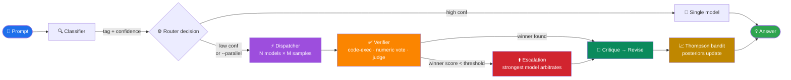

<div align="center">

```
   ┌─┐┬  ┌─┐┌─┐┌┬┐  ┬─┐┌─┐┬ ┬┌┬┐┌─┐┬─┐
   ├┤ │  ├┤ ├┤  │   ├┬┘│ ││ │ │ ├┤ ├┬┘
   ┴  ┴─┘└─┘└─┘ ┴   ┴└─└─┘└─┘ ┴ └─┘┴└─
```

# ⚡ Fleet Router

### Adaptive parallel LLM router with **verifier-driven synthesis** for open-source models on Ollama

**Quality-first. Not fastest. Not cheapest. Best answer.**

[](https://www.python.org/downloads/)
[](#testing)
[](LICENSE)
[](https://ollama.com)
[](#quality-by-default)
[](#drop-in-backends)

</div>

---

## Table of Contents

- [Why Fleet?](#why-fleet)
- [Quick Start](#quick-start)
- [Architecture](#architecture)
- [Features](#features)
- [Models](#models)
- [Drop-in Backends](#drop-in-backends) ← _Claude Code, aider, OpenAI SDK_
- [CLI](#cli)
- [Python API](#python-api)
- [Configuration](#configuration)
- [How It Works](#how-it-works)
- [Eval Harness](#eval-harness)
- [Testing](#testing)
- [Roadmap](#roadmap)
- [Project Layout](#project-layout)

---

## Why Fleet?

> **A single LLM call is a guess. Fleet is a system.**

<table>
<tr>
<th width="50%">👎 Single Ollama call</th>
<th width="50%">👍 Fleet</th>
</tr>
<tr>
<td valign="top">

❌ 1 opinion per prompt
❌ No quality signal
❌ No wrong-answer detection
❌ No self-improvement
❌ No refinement
❌ No disagreement arbitration
❌ No eval harness

✅ Local · 💰 1 call

</td>
<td valign="top">

✅ **3 models × up to 7 samples** (≈21 opinions)
✅ **Code execution / numeric vote / LLM judge**
✅ **Calibrated abstention** (per-tag thresholds)
✅ **Thompson-sampling bandit** (decay + cold-start priors)
✅ **Critique → revise** pass (default ON)
✅ **Escalation to strongest model** (default ON)
✅ **McNemar + bootstrap regression gating**

✅ Local · 💰 up to ~25 calls per prompt

</td>
</tr>
</table>

> **The trade:** per-prompt latency goes 10–30× and cost goes 20–80×, in exchange for measurably better answers. If you want fast and cheap, this isn't it.

### 🛡️ Quality by default

Out of the box, **every quality lever is ON**:

| Lever | Default | Description |
|:------|:--------|:------------|
| Parallel ensemble | **ON** | Up to 3 models race on every prompt |
| Self-consistency | **ON** | 3–7 samples per model, majority-voted |
| Verifier-driven scoring | **ON** | Code AST/exec, math numeric vote, LLM judge |
| Judge de-biasing | **ON** | Self-preference guard + swap-order position-bias guard |
| Calibrated abstention | **ON** | Per-tag thresholds; "I don't know" > confident wrong |
| Disagreement escalation | **ON** | Strongest model arbitrates when verifiers disagree |
| Critique-and-revise | **ON** | Closed-loop: critique → revise → re-verify |
| Bandit learning | **ON** | Thompson sampling with decay + cold-start priors |
| `code_execute` | **OFF** 🔒 | Running LLM code is an RCE vector — hard-gated behind sandbox |

> [!IMPORTANT]
> Even with `code_execute: true`, code **never runs raw** — it only executes through an operator-configured `code_execute_sandbox` command (firejail, bubblewrap, Docker, etc.). No sandbox → AST-only scoring. The AST denylist is an **advisory pre-filter, not a security boundary**.

To downshift (faster, cheaper, lower quality), opt out explicitly in `~/.fleet/config.yaml`. See [Configuration](#configuration).

---

## Quick Start

```bash
git clone https://github.com/Electrum-ai/fleet-router.git
cd fleet-router
python -m venv venv && source venv/bin/activate
pip install -e ".[dev]"

# Make sure Ollama is running with at least one model pulled
ollama pull deepseek-v4-pro:cloud

# Ask away — single prompt, max-quality routing
fleet "solve 2x + 5 = 13"
fleet --parallel "compare microservices vs monolith"
fleet --model glm-5.1 "write a poem about lighthouses"

# Run the eval harness
fleet --eval evals/fixtures/hard/
```

> [!TIP]
> Add `~/fleet-router/venv/bin` to your `PATH` (or symlink `fleet` into `~/.local/bin`) so you can call `fleet` from any directory without `source`-ing a venv.

---

## Architecture



### The synthesis layer

| Tag | Verifier | Quality Signal |
|:----|:---------|:---------------|
| `code` | `CodeVerifier` | AST validity + (opt-in) execution, hard-gated behind a sandbox |
| `math` | `MathVerifier` | Numeric extraction + cross-sample majority vote |
| `reasoning`, `creative`, `summarize`, `translate`, `general` | `JudgeVerifier` | LLM-as-judge with tag-specific rubric (swap-order de-biased) |
| any (fallback) | `HeuristicVerifier` | Length / AST / diversity (legacy synthesizer) |

---

## Features

### 🔬 Verifier-driven synthesis

No more "longest" or "lexically diverse" winning. Each tag has an executable or judge-based scorer. Code is AST-validated (and optionally executed, but only through an operator-configured sandbox — see `code_execute_sandbox`). Math runs majority vote over numeric answers. Reasoning/creative/etc. go to an LLM judge with a tag-specific rubric.

### 🎯 Self-consistency sampling

Math and reasoning tags sample the same model N times (default 7 / 5) and majority-vote. On GSM8K-class problems this closes most of the gap to frontier models with the same base LLM.

### 🛑 Calibrated abstention (per-tag thresholds)

When no candidate clears the quality bar, fleet returns a structured **"I don't know"** instead of a confident wrong answer:

```
(uncertain — <reason>)

Top candidates considered:

--- model-a#0 (score=0.30) ---
<answer>

--- model-b#0 (score=0.30) ---
<answer>
```

Per-tag abstention thresholds account for incommensurable score scales across verifiers — fit them from real outcomes with `fleet --eval --calibrate`.

### ⚖️ Disagreement escalation

Opt-in: when the verifier abstains or the winner score is weak, fleet hands all candidates to a configured stronger Ollama model for arbitration. The arbiter is chosen to avoid self-preference bias — a model never judges its own candidates.

### 🔁 Multi-pass refinement

Opt-in: critique pass identifies errors, revise pass fixes them. **Closed-loop**: the revised output is re-verified before acceptance. ~5–20pp quality lift on most tasks. Doubles latency.

### 📈 Outcome-driven bandit

Thompson-sampling Beta posteriors per `(tag, model)`. Reward = verifier/judge score — **never latency, never cost**.

| Mechanism | Config | Default | Effect |
|:----------|:-------|:--------|:-------|
| Per-round aggregation | automatic | ON | Correlated samples collapse to one observation per model per round |
| Exponential decay | `bandit.decay` | `1.0` (off) | `< 1.0` fades stale evidence from since-upgraded models |
| Cold-start priors | `bandit.priority_prior_strength` | `0.5` | Seeds fresh arms with priority-biased prior (`α = 1 + s/p`, `β = 1`) |

State persists atomically to `~/.fleet/bandit.json`. With bandit enabled, the router Thompson-ranks the **full** tag-matching pool (not just `max_parallel`) so it can explore.

### 🔀 Judge de-biasing

Two independent bias guards on the LLM judge:

| Guard | Mechanism | Effect |
|:------|:----------|:-------|
| **Self-preference** | Neutral arbiter substitution | A model never judges its own candidates |
| **Position bias** | Swap-order averaging | Judge runs twice (original + reversed), per-candidate scores averaged |

### 🧠 Thinking-model aware

`<thinking>...</thinking>` chain-of-thought blocks are stripped at the candidate boundary (before scoring) AND before returning, so reasoning models aren't penalized for verbose internal reasoning and users only see the final answer.

- **Centralized** in `fleet/text.py` — applied once in the synthesizer, again at every consumer boundary (router return, escalation, refinement)
- **Per-class timeout budgets** — reasoning models get their full generation window instead of being cut off at the chat timeout

### 🧪 Eval harness with regression gating

JSONL fixtures + per-tag scorers + multi-choice + comparison harness. Regression gating uses **McNemar exact test** (paired proportions) + **percentile bootstrap confidence intervals** — not ad-hoc thresholds. Small-n abstention guards prevent statistical conclusions on sparse data. `fleet --eval --baseline path.json` exits non-zero on statistically significant regression — wire it into CI.

### 📡 Live progress

Default-on stderr ticker so you see:

```
→ classified as 'creative' (0.42)
→ dispatching 3 models × 5 samples
→ synthesized [verifier]: winner=glm-5.1 (0.78)
```

Instead of staring at a black 60–180s pause. `--quiet` suppresses.

### 📝 Config-backed system prompt

A `system_prompt` field in `config.yaml` lets you set a default system prompt injected into every request (unless the caller provides one). The bundled config ships the **agent-research-patterns** skill — best practices for web research, source quality, copyright compliance, file creation decisions, and tool routing. Override it or set it to empty in your own `~/.fleet/config.yaml`.

---

## Models

This project routes **only to open-source LLMs running on Ollama** (local or `:cloud` tags). Default config:

| Model | Best For | Ollama Tag | Priority |
|:------|:---------|:-----------|:--------:|
| 🌟 **Kimi K2.7** | General default — broad coverage, long-horizon | `kimi-k2.7:cloud` | 1 |
| ✍️ **GLM 5.2** | Creative, Chinese, 1M context, engineering | `glm-5.2:cloud` | 2 |
| 🔥 **DeepSeek V4 Pro** | Code, reasoning, math (strongest reasoner) | `deepseek-v4-pro:cloud` | 3 |
| 🤖 **Kimi K2.7 Code** | Coding-focused agentic, long-horizon coding | `kimi-k2.7-code:cloud` | 4 |
| ⚡ **Qwen 3.5** | Agentic coding, thinking preservation | `qwen3.5:cloud` | 5 |
| 📷 **Gemma 4** | Vision/multimodal, 256K context | `gemma4:31b-cloud` | 6 |
| 💨 **DeepSeek V4 Flash** | Fast drafts | `deepseek-v4-flash:cloud` | 7 |

Drop in any other Ollama model — Qwen, Llama, GPT-OSS, etc. — by adding it to `~/.fleet/config.yaml`.

> [!NOTE]
> OpenAI / Anthropic / proprietary providers are **intentionally not supported** as router targets. The value prop is "best outcome on open-source models." See the next section for using fleet *as a backend for* clients that already speak those APIs.

---

## Drop-in Backends

Fleet's HTTP proxy (`fleet --serve`) speaks **two API dialects**, so any tool that talks to Anthropic Messages or OpenAI Chat Completions can route through fleet → Ollama with a couple of env vars:

| Client | API dialect | Endpoint | Status |
|:-------|:------------|:---------|:------:|
| **Claude Code** | Anthropic | `POST /v1/messages` | ✅ |
| **`anthropic` SDK** | Anthropic | `POST /v1/messages` | ✅ |
| **aider** | OpenAI | `POST /v1/chat/completions` | ✅ |
| **`openai` SDK** | OpenAI | `POST /v1/chat/completions` | ✅ |
| **LiteLLM, llama.cpp UIs, …** | OpenAI | `POST /v1/chat/completions` | ✅ |

Plus utility endpoints: `GET /v1/models` (OpenAI-style listing), `GET /healthz`.

> [!IMPORTANT]
> **Tool / function calling is flattened to text** in both dialects. Anthropic `tool_use`/`tool_result` blocks and OpenAI `tool_calls` payloads don't map cleanly onto fleet's single-prompt-in / single-answer-out interface, so they're rendered as readable summaries the model can see — but it can't *issue* tool calls back to the client. **Plain chat works; agentic tool loops do not.**

### 🤖 As a Claude Code backend

```bash
# 1. Start the proxy (defaults: 127.0.0.1:8765)
fleet --serve --port 8765 --api-key fleet-local &

# 2. Point Claude Code at it
export ANTHROPIC_BASE_URL=http://localhost:8765
export ANTHROPIC_API_KEY=fleet-local

# 3. Use Claude Code as normal — every prompt routes through fleet → Ollama
claude
```

### 🛠️ As an aider backend

```bash
# 1. Same proxy as above. Then:
export OPENAI_API_BASE=http://localhost:8765/v1
export OPENAI_API_KEY=fleet-local

# 2. Pick any fleet-known model (the openai/ prefix is litellm convention)
aider --model openai/kimi-k2.7
aider --model openai/deepseek-v4-pro    # max-quality reasoning
aider --model openai/glm-5.1            # creative / Chinese / long context
```

Or pin it permanently in `~/.aider.conf.yml`:

```yaml
openai-api-base: http://localhost:8765/v1
openai-api-key:  fleet-local
model:           openai/kimi-k2.7
weak-model:      openai/kimi-k2.7
show-model-warnings: false
```

### 🎯 Force-model honoring

The proxy resolves the request's `model` field against the fleet registry and **passes it through as `force_model`** when it matches — so `--model openai/glm-5.1` actually forces glm-5.1 instead of triggering the classifier+ensemble. Unknown names (Claude Code's `claude-opus-4-7`, the placeholder `fleet-router`, etc.) keep auto-route behavior. Provider prefixes (`openai/`, `anthropic/`, `ollama/`, `fleet/`) are stripped automatically; `:cloud` suffixes are tolerated.

### 🪝 Auto-start hook for Claude Code

Inside the fleet-router project, `.claude/settings.json` registers a SessionStart hook that runs `scripts/fleet-ensure-proxy.py` — an idempotent, flock-guarded boot that starts the proxy if it's not up and polls `/healthz`. Runtime state lives in a private `~/.fleet/run/` directory (mode 0700, O_NOFOLLOW on pidfile/logfile). Open a chat in `~/fleet-router` and the proxy is ready before your first message.

### 🔄 Toggle script

A ready-to-use shell helper ships at [`scripts/fleet-toggle.sh`](scripts/fleet-toggle.sh):

```bash
# in ~/.zshrc or ~/.bashrc
source /path/to/fleet-router/scripts/fleet-toggle.sh
```

```bash
fleet-on      # boots proxy + sets ANTHROPIC_BASE_URL in this shell
claude        # routes through fleet → Ollama
fleet-status  # show proxy + env state
fleet-off     # stop proxy + unset env vars; claude goes back to Anthropic
```

> [!WARNING]
> The proxy binds to `127.0.0.1` by default (local only). If you set `--host 0.0.0.0`, **always** also set `--api-key` to prevent open access to your Ollama compute. Auth accepts `x-api-key` (Anthropic style) or `Authorization: Bearer *** (OpenAI style) — both are constant-time compared. Host-header allowlisting prevents DNS-rebinding attacks on non-loopback binds.

---

## CLI

```bash
# Basic usage
fleet "<prompt>"                         # auto-route, verifier synthesis
fleet --parallel "<prompt>"              # force parallel mode
fleet --model glm-5.1 "<prompt>"         # force a specific model (skips classifier)
fleet --config ~/.fleet/config.yaml ...  # custom config
fleet -v "<prompt>"                      # verbose logging to stderr
fleet -q "<prompt>"                      # suppress per-step progress lines

# Eval harness
fleet --eval evals/fixtures/                                # run all fixtures
fleet --eval evals/fixtures/hard/                           # discriminating set
fleet --eval evals/fixtures/hard/ --save-baseline base.json # snapshot
fleet --eval evals/fixtures/hard/ --baseline base.json      # regression gate

# Calibrate per-tag abstention thresholds from eval outcomes
fleet --eval evals/fixtures/ --calibrate thresholds.yaml

# Serve as HTTP proxy
fleet --serve --port 8765 --api-key fleet-local             # bind 127.0.0.1:8765
```

| Exit code | Meaning |
|:--------:|:--------|
| `0` | Success |
| `1` | Error |
| `2` | Sentinel error (e.g. no model available) |
| `3` | Regression detected |
| `130` | Interrupted |

---

## Python API

```python
import asyncio
from fleet import FleetRouter, load_config

router = FleetRouter(load_config())

async def main():
    answer = await router.ask("solve 5x - 3 = 12")
    print(answer)
    await router.aclose()  # closes the aiohttp pool — silences warnings

asyncio.run(main())
```

### Side-by-side comparison

```python
from evals.compare import compare

report = await compare(
    a=("baseline", baseline_router),
    b=("fleet",    fleet_router),
    fixtures_dir="evals/fixtures/hard/",
)
print(report["summary"])
```

---

## Configuration

Resolution order: explicit `--config` path → `~/.fleet/config.yaml` → bundled `fleet/config.yaml` → built-in defaults.

### The shipped defaults (max quality)

```yaml
thresholds:
  single_confidence: 1.01       # >1 → every prompt fans out (always parallel)
  parallel_timeout: 60
  max_parallel: 3

synthesis:
  mode: verifier
  judge_model: deepseek-v4-pro  # strongest model arbitrates judge-based tags
  abstention_threshold: 0.4
  # Per-tag overrides — verifier score scales are incommensurable,
  # so one global 0.4 can't be calibrated for all tags. Fit from real
  # outcomes with: fleet --eval --calibrate thresholds.yaml
  # abstention_thresholds:
  #   math: 0.6
  #   code: 0.55
  judge_swap_order: true        # de-bias position bias (2 judge passes, averaged)
  code_execute: false           # OFF for security — running LLM code is an RCE vector
  code_execute_timeout: 5
  # Sandbox command TEMPLATE. Execution happens ONLY when code_execute is true
  # AND this is non-empty; code then runs THROUGH this command (never raw).
  # {python}/{file}/{dir} are substituted at run time. Empty → never executes
  # (AST-only scoring). The AST denylist is advisory, NOT a sandbox boundary.
  code_execute_sandbox: ""      # e.g. "firejail --net=none --private={dir} {python} {file}"

sampling:
  samples_by_tag:
    math: 7                     # Wang+ majority-vote sweet spot
    reasoning: 5
    code: 3                     # execution check is the strong signal
    default: 3                  # everything else: 3 drafts for the judge
  temperature: 0.7

refinement:
  enabled: true                 # critique → revise pass
  critique_model: deepseek-v4-pro

escalation:
  enabled: true                 # arbitrate divergent answers via stronger model
  model: deepseek-v4-pro
  score_threshold: 0.6

bandit:
  enabled: true                 # outcome-driven Thompson sampling
  state_path: ~/.fleet/bandit.json   # persists posteriors across runs
  decay: 1.0                   # (0,1] — <1.0 applies exponential forgetting
  priority_prior_strength: 0.5 # cold-start: seeds fresh arms with priority-biased prior

# Default system prompt — injected when the caller doesn't provide one.
# Empty string = no system prompt. The bundled config ships the
# agent-research-patterns skill (search behavior, source quality,
# copyright compliance, file creation, tool routing).
system_prompt: |
  You are a research agent. Follow these patterns ...
```

### 🏎️ Downshift recipe (faster, cheaper, less quality)

Drop this in `~/.fleet/config.yaml` to flip every quality lever off:

```yaml
thresholds:
  single_confidence: 0.8        # high-confidence classifications go single-model
sampling:
  samples_by_tag: { default: 1 }
synthesis:
  mode: heuristic               # length/AST picker, no judge calls
refinement:   { enabled: false }
escalation:   { enabled: false }
bandit:       { enabled: false }
system_prompt: ""               # clear the default system prompt
```

### ☁️ Cloud-models recipe

To use Ollama Cloud models (`:cloud` suffix), point `base_url` at `https://ollama.com` and set your API key from [ollama.com/settings/keys](https://ollama.com/settings/keys):

```yaml
ollama:
  base_url: https://ollama.com
  api_key: "<your-key>"
```

The provider sends `Authorization: Bearer *** plus `Accept: application/json` — required by Ollama Cloud or it returns `{"error":"unauthorized"}`.

### Full schema

```yaml
ollama:
  base_url: http://localhost:11434
  api_key: ""                   # set when Ollama requires auth (e.g. cloud models)

models:
  kimi-k2.7:
    tags: [code, reasoning, math, creative, chinese, long_context, summarize, dialogue, translate, general]
    priority: 1                 # default — wins across every tag
    api_model: kimi-k2.7
  deepseek-v4-pro:
    tags: [code, reasoning, math]
    priority: 2
    class: reasoning            # "chat" or "reasoning"
    api_model: deepseek-v4-pro:cloud  # optional override
  glm-5.1:
    tags: [creative, chinese, long_context]
    priority: 3
  # ... etc

classifier:
  embeddings_model: all-MiniLM-L6-v2
  mode: keyword                 # "keyword" or "llm"
  llm_model: ""                 # set to an Ollama model when mode=llm

retrieval:
  enabled: false
  tags: []                      # tags to augment, e.g. [reasoning, general]
  provider: noop                # "noop" or "websearch" (needs SERP_API_KEY)
  max_chars: 4000

# Default system prompt injected into every request (unless overridden).
# Empty string = no system prompt.
system_prompt: ""               # or a multi-line prompt via | YAML block scalar
```

---

## How It Works

### Classification

Keyword regex with **saturating exponential** scoring (1 match → 0.55, 2 → 0.80, 3+ → 0.91). Single accidental matches stay below the parallel-mode threshold. Optional sentence-transformer embedding adds a bounded bonus to the dominant tag. Optional `LLMClassifier` for harder cases (opt-in via `classifier.mode: llm`).

### Routing Decision

| `single_confidence` | Behavior |
|:--------------------|:---------|
| `1.01` (default) | Every prompt fans out to up to N models × M samples |
| `0.8` (downshift) | High-confidence (≥0.8) classifications go single-model fast path |
| `--parallel` flag | Forces parallel regardless of threshold |
| `--model X` / proxy `model: X` | Bypasses classifier entirely; goes straight to model X |

### Verification

Per-tag verifiers replace heuristics.

| Step | CodeVerifier | MathVerifier | JudgeVerifier |
|:-----|:-------------|:-------------|:--------------|
| 1 | AST-walk for dangerous patterns | Extract final numeric answer | Send labeled candidates to judge |
| 2 | Advisory pre-filter (trivially bypassable) | Handle `\boxed{}`, "answer is X", sci notation, decimals | Tag-specific rubric |
| 3 | If sandbox configured: execute through it | Cross-sample majority vote | Run twice (swap order) to cancel position bias |
| 4 | No sandbox → AST-only scoring | | Self-preference guard: neutral arbiter substitution |

### Calibrated Abstention

When the winner's score is below `abstention_threshold` (or a per-tag override in `abstention_thresholds`) OR the verifier flags abstention, fleet returns a structured **"I don't know"** with top candidates and reasons — beats a confident wrong answer. Per-tag thresholds account for incommensurable score scales across verifiers — fit them from real eval outcomes with `fleet --eval --calibrate`.

### Outcome-Driven Bandit

Thompson sampling over `(tag, model)` Beta posteriors. **Reward signal = verifier/judge score in [0,1]** — never latency, never cost.

| Mechanism | Detail |
|:----------|:-------|
| Per-round aggregation | Correlated samples from one generation collapse to **one observation per model per round** (mean candidate score). `samples=5` sharpens the estimate, not the observation count. |
| Decay | `bandit.decay` in `(0,1]` — `<1.0` applies exponential forgetting so stale evidence from since-upgraded models fades. |
| Cold-start priors | `bandit.priority_prior_strength` (default 0.5) seeds fresh arms: `α = 1 + strength/priority`, `β = 1` — configured ordering dominates zero-evidence starts. |
| Persistence | Atomic writes to `~/.fleet/bandit.json`. |
| Exploration | Router Thompson-ranks the **full** tag-matching pool (not just `max_parallel`). |

---

## Eval Harness

Fixtures are JSONL — one case per line. Each gets routed through fleet and scored by a tag-default or per-case scorer.

```jsonl
{"tag": "code", "prompt": "Write merge_intervals(intervals)", "test_code": "assert merge_intervals([[1,3],[2,6]]) == [[1,6]]"}
{"tag": "math", "prompt": "What is gcd(252, 105)?", "expected": 21}
{"tag": "reasoning", "scorer": "multi_choice", "prompt": "...\n(A) ... (B) ...", "expected": "B"}
```

### Built-in scorers

| Scorer | Score = | Used For |
|:-------|:--------|:---------|
| `CodeExecScorer` | 1.0 if `code + test_code` exits 0, else 0.0 | code |
| `NumericMatchScorer` | 1.0 if final number matches `expected` (rel-tol) | math |
| `MultipleChoiceScorer` | 1.0 if extracted A/B/C/D/E matches | reasoning (MMLU-style) |
| `KeywordContainsScorer` | fraction of expected keywords present | summarize, creative, general |

### Regression gating

`--baseline` mode compares a candidate run against a saved baseline using **McNemar exact test** for paired proportions (same fixtures, paired outcomes). A prompt that passes under the candidate but failed under the baseline (or vice versa) is a *discordant pair* — McNemar tests whether the imbalance is statistically significant. The comparison harness also computes **percentile bootstrap confidence intervals** on per-tag accuracy deltas. A small-n guard abstains from statistical claims when a tag has fewer than 10 observations. Exit code `3` signals regression; `0` signals no significant decline.

### Calibration

`--calibrate` fits per-tag abstention thresholds from observed eval outcomes. For each tag, it sweeps candidate thresholds over winner scores and picks the lowest threshold that delivers a target selective accuracy at maximum coverage. Output is a config-ready `abstention_thresholds` block that drops straight into your config.

---

## Testing

```bash
pytest tests/                # 472 passing (1 skips without sentence-transformers)
pytest tests/verifiers/      # verifier framework
pytest tests/evals/          # harness + scorers + calibration + stats
pytest tests/test_proxy.py   # Anthropic + OpenAI proxy compatibility
pytest tests/test_cli.py     # CLI: ask / eval / serve / quiet
```

**472 tests across 34 files** covering:

| Area | What's tested |
|:-----|:-------------|
| Providers | Session reuse, concurrency cap, per-class timeout budgets |
| Verifiers | Code (AST + exec hard-gate), Math (numeric extraction + vote), Judge (rubric + de-biasing), Heuristic |
| Self-consistency | Multi-sample dispatch + majority vote |
| Escalation | Arbiter selection, self-preference guard |
| Refinement | Closed-loop: critique → revise → re-verify |
| Abstention | Per-tag thresholds, self-judge bias guards |
| Bandit | Selection, per-round posterior updates, persistence, decay, cold-start priors |
| Judge de-biasing | Self-preference substitution, swap-order position bias |
| Proxy | Anthropic + OpenAI parsing, streaming, heartbeat, force-model resolver, auth, Host-allowlist, error redaction, body validation, ollama-down enrichment, concurrent requests |
| Config | Validation, system_prompt, all fields |
| Eval | Harness, comparison, calibration, McNemar, bootstrap CI |
| CLI | Eval + serve + calibrate subcommands, non-loopback-bind guard, aclose lifecycle |
| Security | Run-dir perms, O_NOFOLLOW, kill verification, code-exec hard-gate |

---

## Roadmap

| Status | Feature |
|:------:|:--------|
| ✅ | Verifier framework, self-consistency, calibrated abstention, bandit, eval harness, refinement, escalation, retrieval scaffold, event bus |
| ✅ | Anthropic Messages API proxy + OpenAI Chat Completions proxy (drop-in backend for Claude Code, aider, and openai SDK) |
| ✅ | Force-model honoring in proxy + live stderr progress lines + idempotent SessionStart auto-boot |
| ✅ | Thinking-model safety: centralized chain-of-thought stripping, per-class timeout budgets, closed-loop refinement/escalation verification |
| ✅ | Security hardening: non-loopback-bind API-key, Host-allowlist, error redaction, body validation, 0700 runtime dir, O_NOFOLLOW, code-exec hard-gate |
| ✅ | LLM classifier + retrieval wired into router (opt-in) |
| ✅ | Judge de-biasing: self-preference guard + swap-order position-bias guard |
| ✅ | Per-tag abstention thresholds + calibration from eval outcomes |
| ✅ | Bandit hygiene: per-round aggregation, exponential decay, priority-seeded cold-start priors |
| ✅ | Statistically sound regression gating (McNemar exact test + percentile bootstrap CI) |
| ✅ | Config-backed default system prompt (agent-research-patterns) |
| 🛠 | **Class-aware streaming with thinking-model-safe cancellation** |
| 💭 | LLM classifier as default, retrieval for `general` tag by default, Strategy plugin registry, real tool-call translation in proxy |

---

## Project Layout

```
fleet-router/
├── fleet/
│   ├── classifier.py          # keyword + embeddings
│   ├── llm_classifier.py      # zero-shot via instruct model
│   ├── config.py              # YAML schema + validation
│   ├── dispatcher.py          # multi-sample parallel dispatch
│   ├── registry.py            # Ollama model discovery
│   ├── router.py              # orchestration: classify → dispatch → verify → ...
│   ├── synthesizer.py         # legacy heuristic picker
│   ├── bandit.py              # Thompson sampling + persistence
│   ├── events.py              # typed event bus + sinks (incl. cli_progress_sink)
│   ├── text.py                # centralized thinking-strip + text utilities
│   ├── retrieval.py           # NoOp + WebSearch (SerpAPI-shape)
│   ├── proxy.py               # Anthropic + OpenAI HTTP proxy
│   ├── providers/             # Provider Protocol + Ollama
│   └── verifiers/             # Verifier Protocol + per-tag scorers
├── evals/
│   ├── runner.py              # load → score → aggregate → compare
│   ├── compare.py             # side-by-side router comparison
│   ├── calibrate.py           # fit per-tag abstention thresholds from evals
│   ├── stats.py               # McNemar test, bootstrap CI, small-n guards
│   ├── scorers/               # code-exec, numeric, multi-choice, keyword
│   └── fixtures/              # easy + hard JSONL sets
├── scripts/
│   ├── fleet-toggle.sh        # shell-scoped opt-in for Claude Code backend
│   └── fleet-ensure-proxy.py  # idempotent flock-guarded auto-boot
└── tests/                     # 472 tests across 34 files
```

---

## Requirements

- Python 3.12+
- Ollama (local or `:cloud` tags)
- Optional: `sentence-transformers` for embedding-based classification

## License

MIT